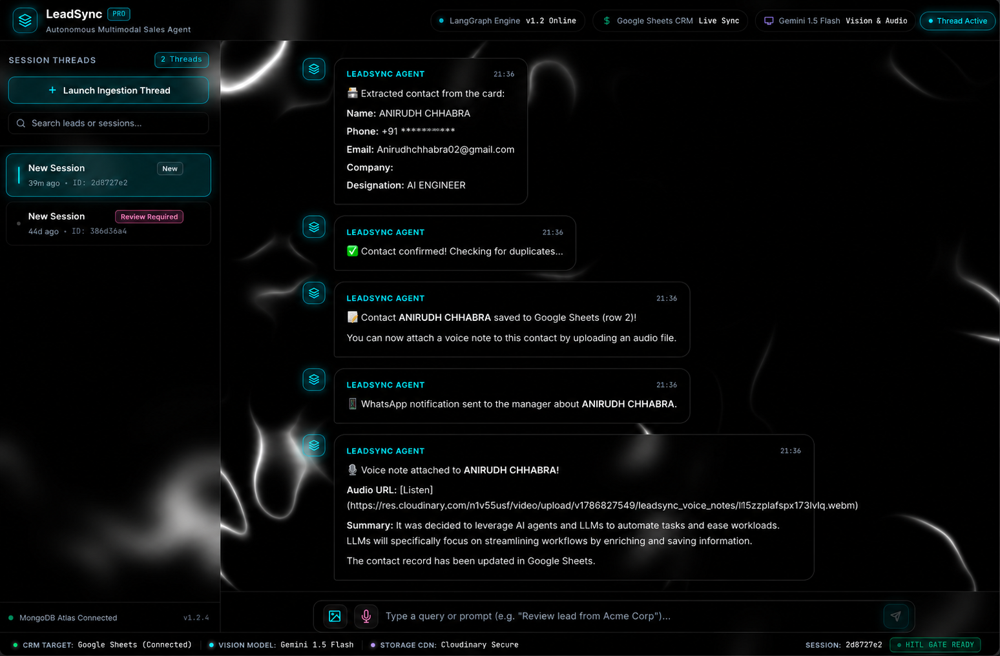
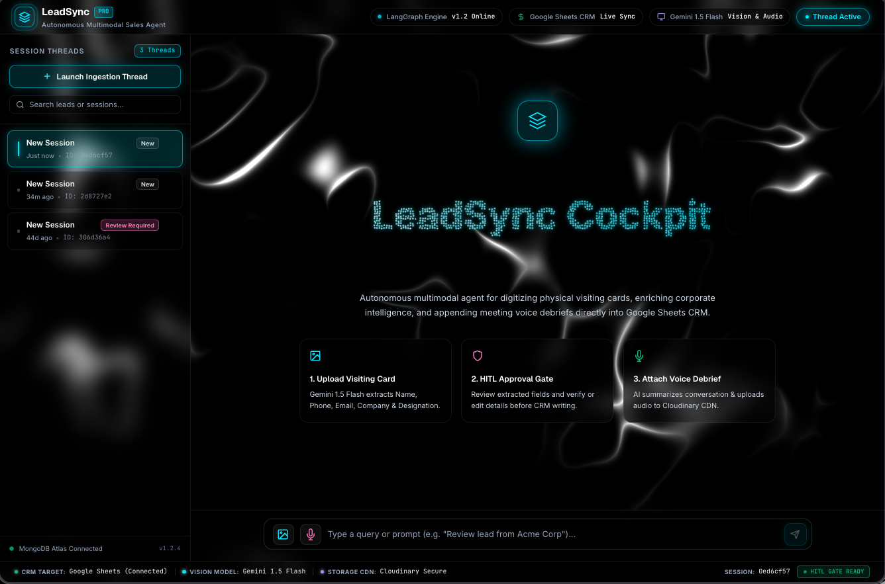

# 📇 LeadSync Agent — Intelligent Multimodal Lead Capture & CRM Sync

<div align="center">

[](https://fastapi.tiangolo.com/)
[](https://reactjs.org/)
[](https://langchain-ai.github.io/langgraph/)
[](https://ai.google.dev/)
[](https://www.mongodb.com/)
[](https://cloudinary.com/)
[](https://opensource.org/licenses/MIT)

**Turn physical visiting cards and spoken meeting notes into structured, enriched CRM records in seconds.**

[🎬 Watch Demo Video](#-demo-video) • [⚡ Key Features](#-key-features) • [🧠 Architecture](#-architecture--langgraph-workflow) • [🛠️ Getting Started](#-getting-started)

</div>

---

## 🎯 The Problem

Every conference, networking dinner, and sales meetup ends the exact same way: a pocket stuffed with physical visiting cards and a head full of quick meeting context.

- **Cards Get Lost or Forgotten**: Physical cards sit on desks or in wallets until they are discarded.
- **Context Decays in 24 Hours**: The verbal agreement, personal rapport, urgency level, or specific follow-up item discussed with the prospect vanishes from memory before anyone sits down to open a CRM.
- **Manual Data Entry Friction**: Typing names, international phone numbers, email addresses, and designations into spreadsheets or CRMs is tedious and prone to typos.
- **Duplicate Records & CRM Clutter**: Without immediate deduplication, sales teams end up with duplicate rows, conflicting notes, and fragmented history.

---

## 💡 The Impact of LeadSync Agent

**LeadSync Agent** was built to eliminate this friction entirely. It serves as an autonomous, multimodal sales copilot right on your phone or laptop:

1. **Snap & Extract**: Take a photo of any visiting card — Gemini Vision extracts Name, Phone, Email, Company, and Designation in structured JSON in under 2 seconds.
2. **Human-in-the-Loop Verification**: An interactive HUD presents the parsed fields with visual confidence indicators, letting you edit or approve before anything touches your database.
3. **Smart Deduplication & Enrichment**: Instantly validates whether the lead already exists in your Google Sheet CRM using normalized contact matching.
4. **Voice Note Context Linking**: Right after the conversation, record a 30-second voice note. The agent uploads the recording to Cloudinary CDN, transcribes and extracts actionable bullet points with Gemini, and links both the summary and audio directly to the lead's row in Google Sheets.
5. **Instant WhatsApp Dispatch**: Automatically triggers template-based WhatsApp follow-ups to keep the deal warm.

> **Result**: Zero lost leads, 100% meeting context retained, and real-time CRM updates in under 30 seconds per contact.

---

## 📸 Visual Showcase & Interface

### 🖥️ Working LeadSync Workspace


### 📊 Lead Management Dashboard


---

## 🎬 Demo Video

<div align="center">

https://github.com/user-attachments/assets/media/Final_Leadsync.mp4

> **Direct file path**: [`media/Final_Leadsync.mp4`](media/Final_Leadsync.mp4)

</div>

---

## ⚡ Key Features

- **👁️ Multimodal Card Extraction**: High-precision OCR and entity extraction powered by Google Gemini 2.5 Flash.
- **🎙️ Real-time Audio Recorder & Soundwave HUD**: In-browser microphone capture with audio buffer waveform visualizer.
- **☁️ Cloudinary CDN Integration**: Automatic cloud storage for audio notes with secure URL generation.
- **📊 Real-time Google Sheets Sync**: Live two-way synchronization into your cloud spreadsheet with deduplication checks.
- **💬 WhatsApp Business API Notifications**: Automated manager alerts and lead confirmations.
- **🛡️ Human-in-the-Loop State Checkpointing**: LangGraph interrupt nodes guarantee user validation before database mutations.
- **💾 Persistent MongoDB Session Store**: Full conversation and state persistence across page refreshes and devices.
- **🎨 Glassmorphic Cyber HUD Aesthetic**: Futuristic cyberpunk-inspired user interface built with custom CSS tokens and micro-animations.

---

## 🧠 Architecture & LangGraph Workflow

The core intelligence is powered by a cyclic **LangGraph StateGraph** that cleanly orchestrates perception, human intervention, and external tool execution:

```
                  ┌────────────────────────┐
                  │   User Uploads Card    │
                  └───────────┬────────────┘
                              │
                              ▼
                  ┌────────────────────────┐
                  │   extract_card_data    │  ◄── Gemini 2.5 Flash Vision
                  └───────────┬────────────┘
                              │
                              ▼
                  ┌────────────────────────┐
                  │    enrich_company      │  ◄── LLM Company Discovery
                  └───────────┬────────────┘
                              │
                              ▼
                  ┌────────────────────────┐
                  │   confirm_with_user    │  ◄── [HUMAN-IN-THE-LOOP INTERRUPT]
                  └───────────┬────────────┘      (User edits/approves in UI)
                              │
                    User Confirmed?
                   ┌──────────┴──────────┐
                   │                     │
                  Yes                    No ──► [Session Reset]
                   │
                   ▼
         ┌───────────────────┐
         │deduplicate_contact│ ◄── Scans Google Sheets for duplicate phone/email
         └─────────┬─────────┘
                   │
                   ▼
         ┌───────────────────┐
         │  write_to_sheets  │ ◄── Inserts verified lead into Google Sheets
         └─────────┬─────────┘
                   │
                   ▼
         ┌───────────────────┐
         │send_whatsapp_alert│ ◄── WhatsApp Cloud API Notification
         └─────────┬─────────┘
                   │
                   ▼
         ┌───────────────────┐
         │process_voice_note │ ◄── Uploads to Cloudinary, Gemini Transcribes,
         └───────────────────┘     Appends summary & audio link to Sheet row
```

---

## 🛠️ Tech Stack

### Backend
| Technology | Role |
| :--- | :--- |
| **FastAPI** | High-performance asynchronous Python API framework |
| **LangGraph / LangChain** | Agentic state graph orchestration and interrupt checkpoints |
| **Google Gemini 2.5 Flash** | Multimodal Vision (card OCR) and Audio (voice transcription & summarization) |
| **MongoDB Atlas + Motor** | Asynchronous session persistence and chat history storage |
| **Google Sheets API (`gspread`)** | Cloud spreadsheet CRM database |
| **Cloudinary** | Audio asset hosting and global CDN delivery |
| **WhatsApp Cloud API** | Enterprise WhatsApp messaging and automated follow-ups |

### Frontend
| Technology | Role |
| :--- | :--- |
| **React 18 + Vite** | Blazing-fast modern frontend build |
| **Lucide Icons** | Clean, minimalist iconography |
| **Vanilla CSS** | Tailored dark-mode glassmorphic theme with interactive HUD elements |
| **MediaStream API** | Native in-browser voice note audio recording |

---

## 🚀 Getting Started

### 1. Clone the Repository
```bash
git clone https://github.com/AnirudhChhabra54/LeadSync_Agent.git
cd LeadSync_Agent
```

### 2. Environment Configuration
Create a `.env` file in the project root:

```env
# ─── MongoDB Atlas ───────────────────────────────────────────
MONGODB_URI=mongodb+srv://<username>:<password>@cluster0.mongodb.net/?appName=Cluster0

# ─── Google Sheets ───────────────────────────────────────────
GOOGLE_SHEET_ID=your_google_sheet_id_here
GOOGLE_SERVICE_ACCOUNT_JSON={"type": "service_account", "project_id": "...", "private_key": "...", ...}

# ─── Google Gemini API ───────────────────────────────────────
GEMINI_API_KEY=your_gemini_api_key_here

# ─── WhatsApp Business API ───────────────────────────────────
WHATSAPP_ACCESS_TOKEN=your_whatsapp_access_token
WHATSAPP_PHONE_NUMBER_ID=your_phone_number_id
WHATSAPP_MANAGER_NUMBER=919876543210  # e.g., 919876543210 (country code + number, no + prefix)
WHATSAPP_TEMPLATE_NAME=jaspers_market_order_confirmation_v1
WHATSAPP_TEMPLATE_LANG=en_US

# ─── Cloudinary (Audio Hosting) ──────────────────────────────
CLOUDINARY_CLOUD_NAME=your_cloud_name
CLOUDINARY_API_KEY=your_cloudinary_api_key
CLOUDINARY_API_SECRET=your_cloudinary_api_secret
```

### 3. Backend Setup
```bash
cd backend
python3 -m venv venv
source venv/bin/activate  # On Windows: venv\Scripts\activate
pip install -r requirements.txt
python3 -m uvicorn app.main:app --host 0.0.0.0 --port 8001 --reload
```

### 4. Frontend Setup
```bash
cd frontend
npm install
npm run dev
```

Open [http://localhost:5173](http://localhost:5173) in your browser.

---

## 📁 Repository Structure

```
LeadSync_Agent/
├── backend/
│   ├── app/
│   │   ├── agent/
│   │   │   ├── nodes/          # LangGraph graph execution nodes (extract, confirm, dedup, voice, etc.)
│   │   │   ├── graph.py        # LangGraph StateGraph compilation
│   │   │   └── state.py        # State definitions
│   │   ├── routes/             # FastAPI REST endpoints (chat, sessions)
│   │   ├── services/           # External services (Gemini, Sheets, MongoDB, Cloudinary, WhatsApp)
│   │   ├── config.py           # Pydantic settings
│   │   └── main.py             # App entry point
│   ├── Dockerfile
│   └── requirements.txt
├── frontend/
│   ├── src/
│   │   ├── components/         # React UI components (HUD, ChatWindow, InputBar, Sidebar)
│   │   ├── hooks/              # Custom React hooks (useChat)
│   │   ├── api/                # API client
│   │   ├── App.jsx             # Main Application layout
│   │   └── index.css           # Glassmorphism & Cyber HUD styling
│   ├── package.json
│   └── vite.config.js
├── media/
│   ├── Final_Leadsync.mp4      # Full walkthrough & demo video
│   ├── LeadSyncDashboard.png   # Dashboard screenshot
│   └── WorkingLeadSync.png     # Live interaction interface screenshot
└── README.md
```

---

## 🌟 Future Roadmap

- [ ] **AI Meeting Follow-up Drafter**: Auto-generate personalized email drafts based on the voice note summary.
- [ ] **Multi-lingual Voice Notes**: Live real-time translation for global international trade expos.

---

## 👤 Author & Acknowledgements

Developed with ❤️ by **Anirudh Chhabra**  
- **GitHub**: [@AnirudhChhabra54](https://github.com/AnirudhChhabra54)  
- **LinkedIn**: [Anirudh Chhabra](https://linkedin.com/in/anirudhchhabra54)

---

## 📄 License

This project is licensed under the MIT License — see the [LICENSE](LICENSE) file for details.
